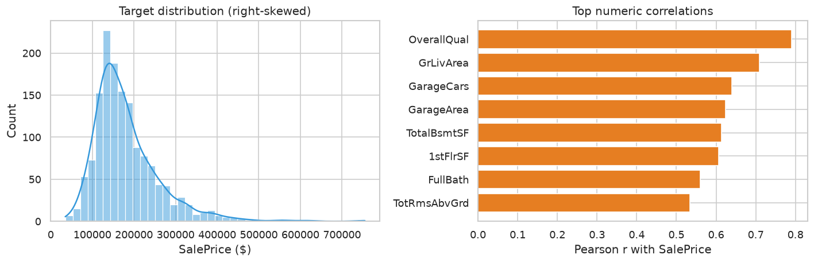
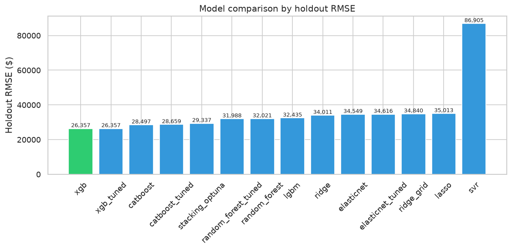
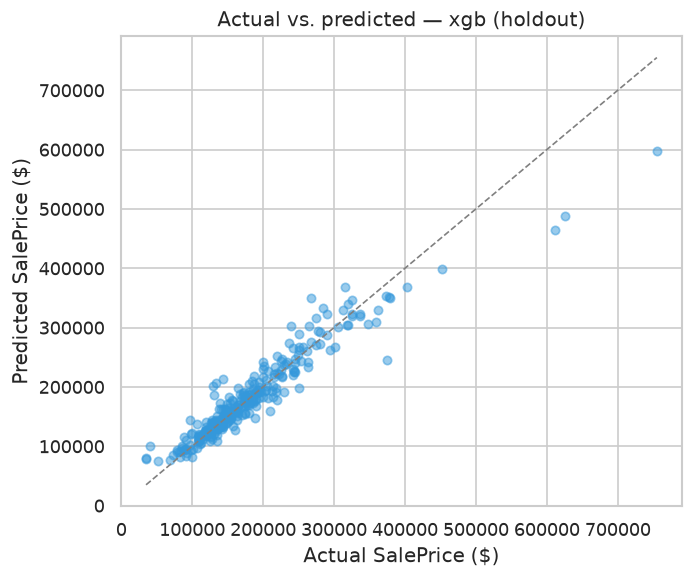

# House Prices — Advanced Regression Techniques

Predict home sale prices on the Ames Housing dataset (1,460 labeled rows, 79 mixed-type features). The focus is **holdout RMSE / R²**, comparing **8 baseline regressors**, **Optuna-tuned top models**, and a **stacking ensemble** for the Kaggle submission.

## Results at a glance

| Metric | Value |
|--------|-------|
| Best single model (holdout) | **XGBoost** — RMSE **$26,357**, R² **0.905** |
| Stacking ensemble (Kaggle submission) | **stacking_optuna** — holdout RMSE $29,337, CV-RMSE **$25,609** |
| Runner-up | CatBoost (RMSE $28,497), Random Forest (RMSE $32,021) |
| Weakest baseline | SVR (RMSE $86,905 — RBF kernel doesn't scale here) |
| Models evaluated | 14 (8 baselines + 5 tuned + stacking) |
| Submission rows | 1,459 |
| Model artifact | `outputs/stacking_optuna.joblib` |

Metrics from the latest run are saved in [`docs/assets/run_summary.json`](docs/assets/run_summary.json).

## Visual results







## Key takeaways

- **Tree boosters dominate** — XGBoost and CatBoost reach R² ≈ 0.89–0.90, while linear models (Ridge/Lasso/ElasticNet) plateau around R² ≈ 0.83–0.84 because quality × area × neighborhood interactions are highly non-linear.
- **Stacking vs. single model trade-off** — stacking wins on **CV-RMSE** ($25.6k vs. $28.3k for XGBoost) and is used for the Kaggle submission, but its holdout RMSE ($29.3k) is slightly worse than XGBoost alone. CV-optimized ensembles don't always beat a strong single model on one random split.
- **Preprocessing is shared** — all 14 models use the same sklearn pipeline: ordinal encoding, domain features, variance filter, and mutual-information top-200 feature selection.
- **SVR fails badly** here — RBF-SVR with default settings collapses to near-zero R² on ~200 high-dimensional mixed features.

## Quick start

```bash
pip install -r requirements.txt
jupyter notebook house_prices_regression.ipynb
```

Run all cells top to bottom. The notebook:
1. Loads `data/train.csv` and `data/test.csv`, does EDA on the target and top correlations.
2. Builds the shared preprocessing pipeline and a stratified holdout split.
3. Loads saved results from `outputs/model_results.csv` (from a prior full run) — or set `RUN_FULL_PIPELINE = True` at the top to retrain everything (~60–90 min CPU).
4. Plots the RMSE leaderboard, actual vs. predicted for XGBoost, and saves charts + `run_summary.json`.

### Re-running the full pipeline

In the first code cell, set:

```python
RUN_FULL_PIPELINE = True   # ~60–90 min on CPU
SMOKE_TEST = False       # set True for a ~5 min sanity check
```

This trains 8 baselines, Optuna-tunes the top 5, searches stacking combos, saves `outputs/model_results.csv`, and writes the Kaggle submission.

## Project structure

```
house-prices-regression/
├── house_prices_regression.ipynb   # main notebook (EDA → models → analysis → artifacts)
├── src/
│   ├── preprocessing/              # feature pipeline (used by the notebook)
│   └── modeling/                   # ModelTrainer (baselines, Optuna, stacking)
├── data/
│   ├── train.csv
│   ├── test.csv
│   └── data_description.txt
├── docs/
│   └── assets/                     # README charts + run_summary.json (committed)
├── outputs/                        # model_results.csv, submissions, .joblib (gitignored)
└── requirements.txt
```

## Dataset

[House Prices — Advanced Regression Techniques](https://www.kaggle.com/competitions/house-prices-advanced-regression-techniques) — Ames, Iowa housing sales with 79 explanatory variables (numeric + categorical) describing square footage, quality/condition ratings, garage, basement, and neighborhood. Target: `SalePrice` (USD).
